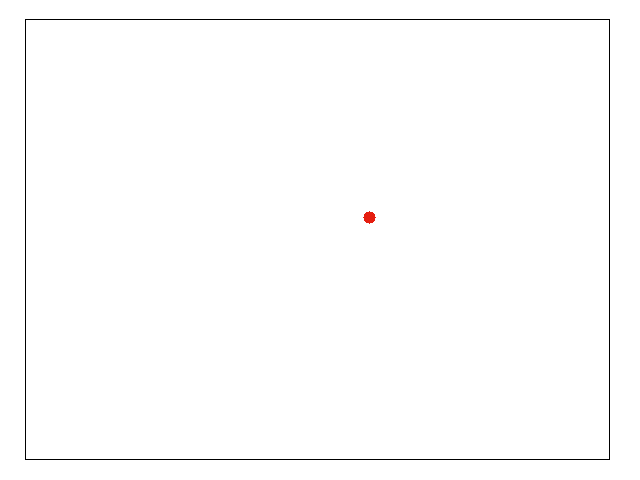

# CUDA-Classical-Trajectory-Monte-Carlo-method-for-electron-hydrogen-collisions

The red electron is orbiting around the proton. The black electron passes by. Due to their mutual Coulomb interaction, the red electron is freed. That means, the hydrogen atom has ionized!

We would like to calculate the cross section for this event given the initial energy of the black electron, and the energy level of the red electron (the state of the hydrogen atom).

The Classical Trajectory Monte-Carlo (CTMC) method is applied to compute the cross section. In CTMC method, for a given impact parameter, N number of black electrons are shot towards the hydrogen atom. Out of this N, n number of ionization events occur. Then we have the ionization probability n/N for a given impact parameter. The cross section is the integrated ionization probability over a range of impact parameters.

In CUDA calculations, each gpu thread handles a different impact parameter. That means, we can compute the cross section at once without iterating over the impact parameters in a serial program. 

Following Figure shows the hydrogen 1s ionization cross section upon electron impact as a function of the incident electron energy.

